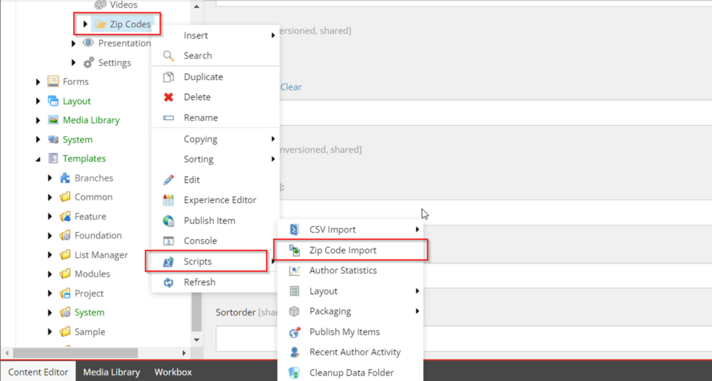
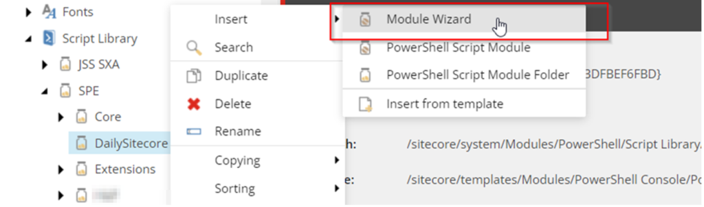
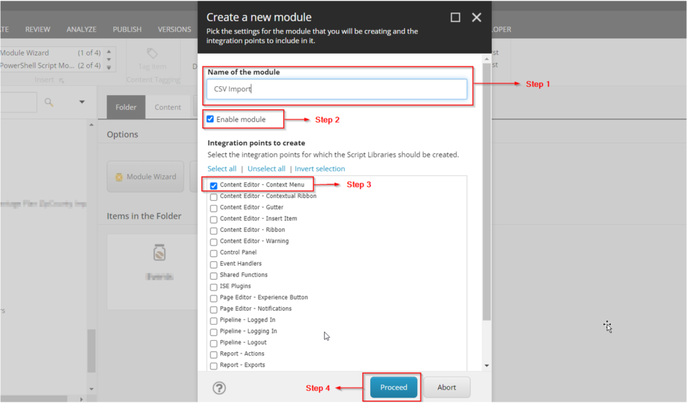
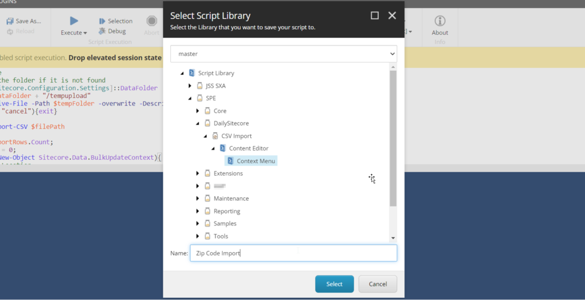
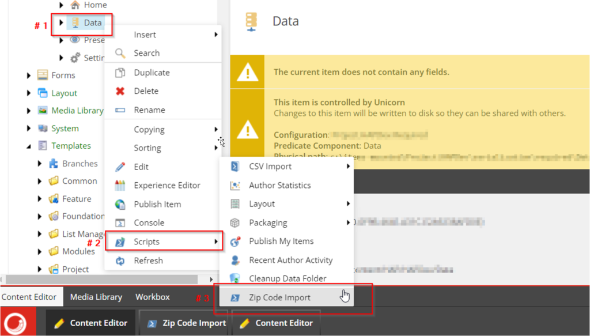
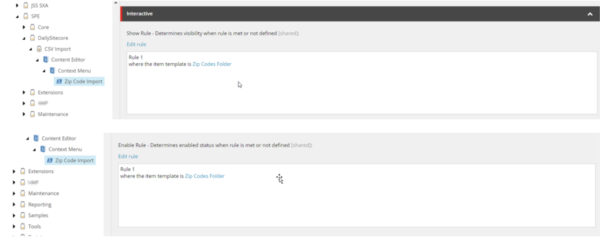
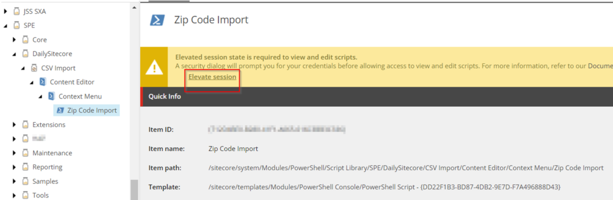
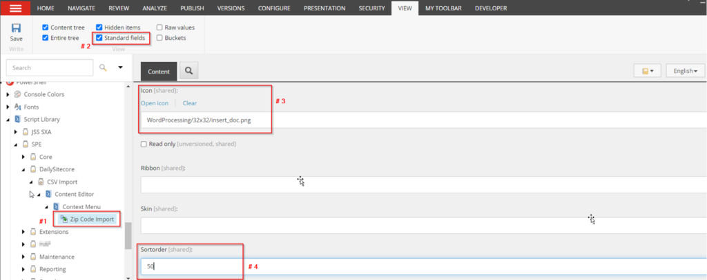

This blog describes how to make any **PowerShell script appear in the context menu** of an item in Sitecore SXA. As a result, these menu options should only be available when necessary. We'll also see ShowRule and EnableRule fields in the PowerShell script items for hiding/showing and enabling/disabling based on some fundamental Sitecore rules.

**Context Menu -** When we right-click on any Sitecore item, a menu with multiple options such as Insert, search, duplicate, and so on appears. This menu is known as the Item Context Menu.

**PowerShell Script in Context Menu - **In Sitecore, we can add PowerShell scripts to the scripts area of the item context menu. The goal of adding Powershell scripts to the context menu is to make it possible to run the script from any item. As a result, it becomes more author-friendly.

**Interactive PowerShell Scripts -** We can create an interactive PowerShell script using the Sitecore PowerShell Extension. This improves an author's UI experience by displaying dialog boxes with results, outputs, or dialog boxes for taking any inputs from them.



## Let's Add PowerShell Script to the Context Menu in Sitecore SXA

Let's start with a simple business scenario: suppose we have a "Zip Codes" list in a CSV file.

    - We should be able to run the file import on a specific data folder only.

    - We want all Zip Codes items automatically created inside the target folder. (Assumption: we have the template for the zip code item)

So, in this section, we will write an interactive PowerShell script. This will prompt the user to upload a CSV file via interactive dialogue. We will add the hand to the context menu. This script option should be available only for Zip Code Folder and hidden for any other Sitecore item.

### Step 1: Create A PowerShell Script Module.

When we create a Powershell script, we need to save it somewhere. Sitecore PowerShell keeps all PowerShell scripts in the Script Library (PowerShell Script Library).

The script library is located at "***Sitecore>System>Modules>PowerShell>Script Library***." It organizes the script under modules for easier access.

    - Under the 'SPE' folder, we will create a folder with a module folder template for our project.

    - Creating a new folder with my project name, "DailySitecore."

Now, right-click the project folder and select Insert. There are several insert options available here. As shown in the image below, we will select "**Module Wizard**" to create a new module within our project folder.



To begin the process of creating a new PowerShell script module. When you click on the Module Wizard, a dialogue box will appear, asking for input. Because we only need this module for the context menu, I have only provided the inputs I require.

    - Give the module a meaningful name.

    - Check the "Enable Module" checkbox

    - Choose "Content Editor - Context Menu" from the list

    - Proceed



A module folder will be created when you click the "Proceed" button. The module folder will have the "Content Tree" and "Context Menu" folders.

Now that your PowerShell script module has been successfully created. You can keep the PowerShell script in the **Context Menu** folder.

**Note:** All scripts placed in this folder will now be visible in the Context Menu's Scripts sections for all Sitecore items.

### Step 2: Create Interactive PowerShell Script for CSV Import.

Following the creation of the module, we will write an interactive PowerShell script using PowerShell ISE. Here, we can refer to the documentation to learn how to create interactive dialogs using [Sitecore PowerShell](https://doc.sitecorepowershell.com/interfaces/interactive-dialogs).

Go to the Launchpad and launch the PowerShell ISE, then write the script shown below.

```
# Upload CSV file
#It will create the folder if it is not found
$dataFolder = [Sitecore.Configuration.Settings]::DataFolder
$tempFolder = $dataFolder + "/tempupload"
$filePath = Receive-File -Path $tempFolder -overwrite -Description "Please Upload a CSV file" -Title "Data Import"
if($filePath -eq "cancel"){exit}

$importRows = Import-CSV $filePath
$index = 1;
$totalRows = $importRows.Count;
$PercentComplete = 0;
New-UsingBlock (New-Object Sitecore.Data.BulkUpdateContext){
    #Data Folder Location
    $item = Get-Item .
    $zipCodeFolderPath = $item.Paths.FullPath

    #Template Location
    $zipCodeTemplatePath = "/sitecore/templates/Project/DailySitecore/Zip Code"

    #Field Name
    $zipcodeItemField = "ZipCode"

    #Check If All Path are Valid
    Function Show-PathNotFound-Message($Path){
        Show-Alert -Title "'$Path' doesn't exist!"
        Write-Host "'$Path' doesn't exist!" -ForegroundColor Red;
        exit
    }

    if (-Not (Test-Path $zipCodeFolderPath)) {
        Show-PathNotFound-Message($zipCodeFolderPath);
    }

    #Get all entries from CSV
    foreach ($row in $importRows)
    {
        Write-Progress -Activity "Processing records ($index / $totalRows)" -Status "$PercentComplete% Complete:" -PercentComplete $PercentComplete

        $zipCode = $row.Zipcode

        Function Show-ErrorMessage($msg){
            Show-Alert -Title "$msg"
            Write-Host $msg -ForegroundColor Red;
            exit
        }
        if($zipCode -eq $null){
            Show-ErrorMessage("CSV should contains header row as Zipcode");
        }

        #Adding ZipCode if Not present
        $zipCodeItemPath = $zipCodeFolderPath+"/"+$zipCode
        if(Test-Path -Path $zipCodeItemPath){
            Write-Host "$zipCode is already Exits" -ForegroundColor Yellow;
        }
        else{
            $item  = New-Item -Path $zipCodeFolderPath -Name $zipCode -ItemType $zipCodeTemplatePath
            $item.Editing.BeginEdit()
            $item[$zipcodeItemField] = $zipCode
            $item.Editing.EndEdit()
            $newZipId = $item.ID;
            Write-Host "$index Item created for: $zipCode";
        }
     $index++;
     $PercentComplete = [int] (($index / $totalRows) * 100)
    }
}
```

After you've finished, click the save button and navigate to your module's Context Menu folder. Enter a name for the script and press the Select button.



Congratulations! Your script is now complete and appears in the Context Menu. Right-click on any item to confirm that you can now see the script in the menu, as shown in the image below.



But wait, the script will be displayed when you right-click on any item in the Sitecore tree. However, in this case, we only need this script to appear in the Zip Code Data Folder (An item created from a specific template). To accomplish this, we will need to add some rules to the script, which we will see in the next step.

### Step 3: Setting up Rules for Script (Show-Rule & Enable-Rule)

Every Powershell script item has two fields: ShowRule and EnableRule. The show-rule and enable-rule are used to control the visibility of the script in the context menu for any item.

**ShowRule:** This field displays the script option only when the scenario matches the given condition.

**EnableRule:** This field enables or disables the script option only when the scenario matches the given condition. The script will still be visible but disabled if the condition does not match.

Follow the steps outlined below.

    - Choose the script item.

    - Navigate to the Interactive Section and then to the "ShowRule" / "EnableRule" Field

    - Edit Rules > Add the necessary rule (as shown below)



Only items created from the template "Zip Codes Folder" will display this script. The script option will not be available in the context menu for other Sitecore items.

**Note:** If you cannot see the fields, this may be due to security concerns; in this case, click on 'Elevate Session' at the top. It will prompt you for credentials before displaying all fields.



### Step 4: Change the Appearance of the Script

We can also change how the script option appears. To give the authors a more descriptive appearance. Changing the appearance is similar to changing the appearance of other Sitecore items.

We will change the script's **icon** and want it to appear in the top second by **order** in the context menu.

    - In our case, select the script item 'Zip Code Import' from the CSV Import module in Script Library.

    - Go to the View tab and enable standard fields to view.

    - Modify the Icon in the Icon field (select the relevant icon concerning the script's working).

    - Modify the sort order (to specify an order of appearance in the menu).



Our script is now ready to appear in the context menu of the Zip Code Folder item.

I hope you found this helpful article. Happy Learning!!
