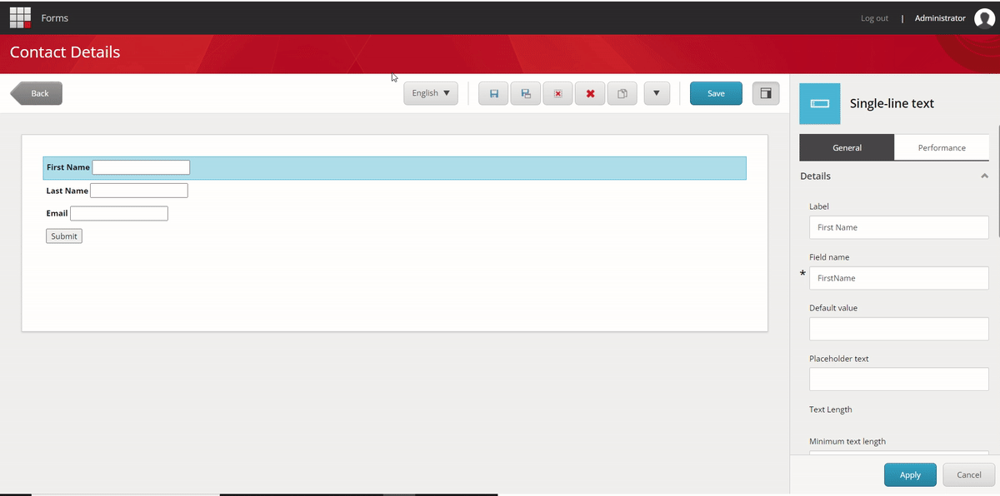
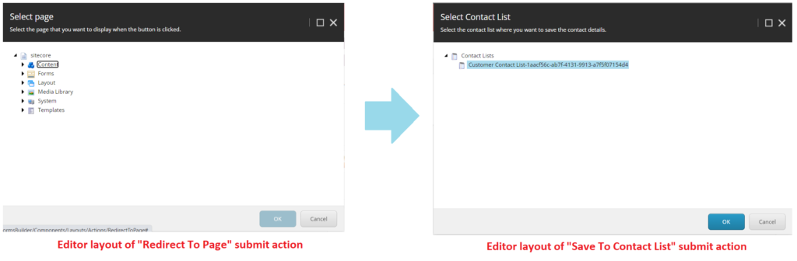
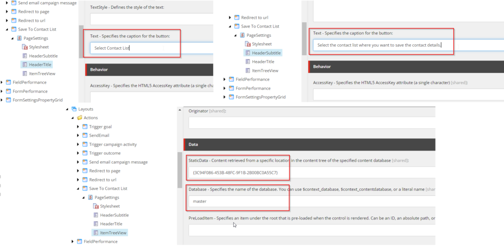
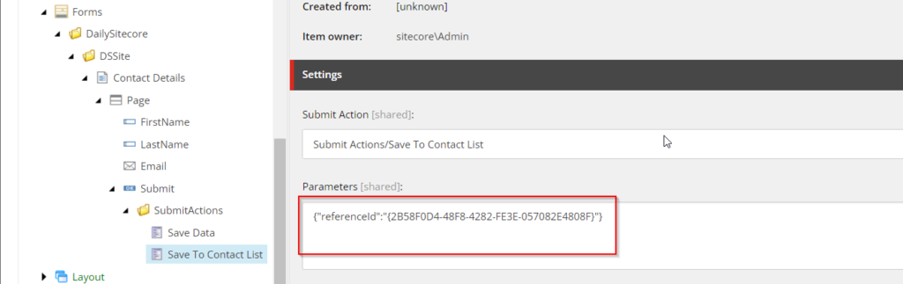
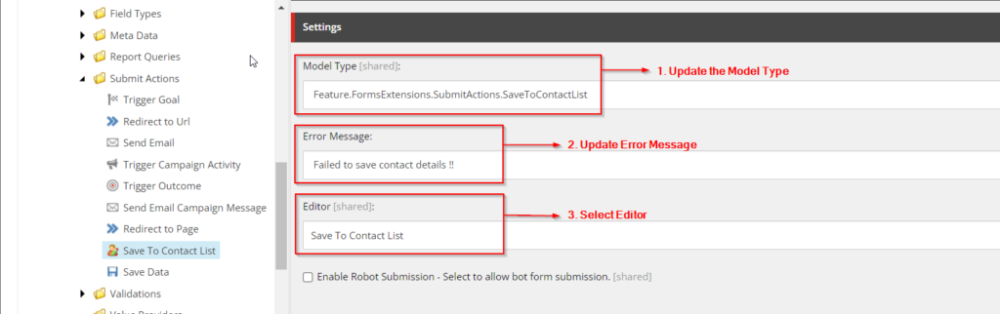
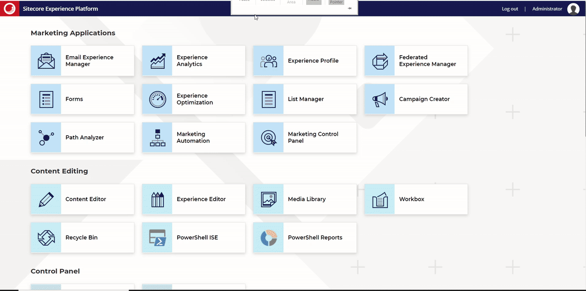

A custom submit action for Sitecore forms that will **save contact information to the list manager's contact list**. It will allow us to collect the contact details from the end user through a Sitecore form and save them to the contact list inside the list manager. The article contains a step-by-step guide for creating a custom submit action to save contacts in List Manager in Sitecore.

The series includes the following parts:

    - [Submit Action to Save Contacts in List Manager – Basic Implementation](#basicImplementation)

    - [Submit Action to Save Contacts in List Manager with Fields Mapping Part 1: Create SPEAK Editor](https://blogs.perficient.com/2023/06/01/submit-action-to-save-contacts-in-list-manager-with-fields-mapping-part-1/)

    - [Submit Action to Save Contacts in List Manager with Fields Mapping Part 2: Create Submit Action](https://blogs.perficient.com/2023/06/02/submit-action-to-save-contacts-in-list-manager-with-fields-mapping-part-2)

[caption id="attachment_334488" align="aligncenter" width="1200"]



 Using Save Contacts To Contact List Custom Submit Action in Sitecore Form Editor[/caption]

Here, we will cover the basic implementation **without the ability to map form fields** to the custom-created submit action. This custom submit action will only have the Item Tree View field to select the contact list. It can be created by cloning *RedirectToPage* (an existing submit action in Sitecore) to use its SPEAK editor layout. Find the below steps for creating the custom submit action to save contacts in Sitecore List Manager's contact list.

## Developing a Custom Submit Action to Save Contacts in List Manager

### Step 1: Create Editor layout

First, we will create an editor for custom submit action in the Core database.

[caption id="attachment_333523" align="aligncenter" width="1024"]



 Editor Layout For Submit Action[/caption]

The editor layouts for form actions are in the path given below. First, navigate to this path.

```
Core: /sitecore/client/Applications/FormsBuilder/Components/Layouts/Actions
```

Now, follow the steps mentioned below:

    - Make a duplicate item for the "Redirect to Page" item.

    - Change the item name to "*SaveToContactList.*"

    - Update the browser title and display name fields.

    - Expand the child items of the PageSettings item.

```
Core:/sitecore/client/Applications/FormsBuilder/Components/Layouts/Actions/SaveToContactList/PageSettings
```

    - Select *HeaderTitle* and change the "*Text - Specifies the caption for the button fields"* field value.

```
Example: "Select Contact list"
```

    - Select *HeaderSubtitle *and change the "*Text - Specifies the caption for the button fields"* field value.

```
For instance, Select the desired contact list for storing the contact details.
```

    - Select *ItemTreeView* and make changes in the following fields:

    *IsCheckModeEnabled* - Make sure to keep it unchecked.

    - *Database* – Update the database from "$context_contentdatabase" to "master."

    - *Static Data* – Update Guid of *Contact List* folder located at "master: */sitecore/system/Marketing Control Panel/Contact Lists"* and its guid is "*{3C94F086-453B-48FC-9F1B-2B00BC0A55C7}.*"

**Note:** The current context database is core. We can't directly choose the contact list folder (which is in the master) from the item tree. We must update the field with the item's guid. Enable the display of field values as raw values, then change the field values.

[caption id="attachment_333370" align="aligncenter" width="1024"]



 Editor Layout Fields Update - Save To Contact List[/caption]

Now, the editor layout for the SaveToContactList Submit Action is ready. After that, we must create an item for submit action in the master database.

### Step 2: Create a Submit Action Item

Switch to the master database and navigate to the following location.

```
Master: /sitecore/system/Settings/Forms/Submit Actions
```

    - Make a duplicate item for the "Redirect to Page" item.

    - Rename it to "Save To Contact List."

    - Update the field value of *Error Message*, Example: "Failed to save contact details!!"

    - Select the "Save To Contact List" option for the *Editor* field

    - Change the icon from the Appearance section

Our custom submit action is almost ready but still refers to the *RedirectToPage* code. We must create a new class to save the form data into the contact list. The *SaveToContactList* also uses the same parameter key (used in *RedirectToPage*) named "referenceid". This parameter key stores the selected value of ItemTreeValue fields shown in the image below.

[caption id="attachment_333368" align="aligncenter" width="1024"]



 Parameters field- Save To Contact List Item[/caption]

### Step 3: Create Submit Action Class to Save Contacts in Contact List

Create a new model class for the parameter data as given below.

```
using System;

namespace Feature.FormsExtensions.Models
{
    public class ContactListParameters
    {
        public Guid ReferenceId { get; set; }
    }
}
```

Now we will create a new class and override Execute method. Add a new class file named SaveToContactList.cs in the SubmitActions folder.

**Note:** We use [xConnect Client API](https://doc.sitecore.com/xp/en/developers/93/sitecore-experience-platform/xconnect-client-api-overview.html) instead of [List Manager API](https://doc.sitecore.com/xp/en/developers/92/sitecore-experience-manager/the-list-manager-api.html) for this implementation. Contact lists are stored in Sitecore as marketing definitions. You can only access contact lists programmatically via the List Manager API on the CM instance; the List Manager API will not work ***on CD instances*** because ***the List Manager application is disabled***.

```
using System;
using System.Collections.Generic;
using System.Linq;
using Sitecore.Diagnostics;
using Sitecore.ExperienceForms.Models;
using Sitecore.ExperienceForms.Processing;
using Sitecore.ExperienceForms.Processing.Actions;
using Sitecore.XConnect;
using Sitecore.XConnect.Client;
using Sitecore.XConnect.Client.Configuration;
using Sitecore.XConnect.Collection.Model;
using Feature.FormsExtensions.Models;

namespace Feature.FormsExtensions.SubmitActions
{
    public class SaveToContactList : SubmitActionBase
    {
        public SaveToContactList(ISubmitActionData submitActionData) : base(submitActionData)
        {
        }

        protected override bool Execute(ContactListParameters data, FormSubmitContext formSubmitContext)
        {
            Assert.ArgumentNotNull(data, nameof(data));
            Assert.ArgumentNotNull(formSubmitContext, nameof(formSubmitContext));

            var firstNameField = formSubmitContext.Fields.FirstOrDefault(field => field.Name.Equals("FirstName"));
            var lastNameField = formSubmitContext.Fields.FirstOrDefault(field => field.Name.Equals("LastName")); ;
            var emailField = formSubmitContext.Fields.FirstOrDefault(field => field.Name.Equals("Email"));

            if (firstNameField == null && lastNameField == null && emailField == null)
            {
                return false;
            }

            try
            {
                using (var client = CreateClient())
                {
                    return SaveContactInListManager(client, firstNameField, lastNameField, emailField, data.ReferenceId);
                }
            }
            catch (XdbExecutionException exception)
            {
                Logger.LogError(exception.Message, exception);
                return false;
            }
        }

        private bool SaveContactInListManager(IXdbContext client, IViewModel firstNameField, IViewModel lastNameField, IViewModel emailField, Guid contactListId)
        {
            try
            {
                var reference = new IdentifiedContactReference("ListManager", GetValue(emailField));

                var expandOptions = new ContactExpandOptions(
                        CollectionModel.FacetKeys.PersonalInformation,
                        CollectionModel.FacetKeys.EmailAddressList,
                        CollectionModel.FacetKeys.ListSubscriptions);

                var executionOptions = new ContactExecutionOptions(expandOptions);

                Contact contact = client.Get(reference, executionOptions);

                if (contact == null)
                {
                    contact = new Sitecore.XConnect.Contact();
                    client.AddContact(contact);
                }

                SetPersonalInformation(GetValue(firstNameField), GetValue(lastNameField), contact, client);
                SetEmail(GetValue(emailField), contact, client);
                SetSubscriptionList(client, contact, contactListId);

                var contactIdentifier = new ContactIdentifier("ListManager", GetValue(emailField), ContactIdentifierType.Known);
                if (!contact.Identifiers.Contains(contactIdentifier))
                {
                    client.AddContactIdentifier(contact, contactIdentifier);
                }

                client.Submit();
                return true;
            }
            catch (XdbExecutionException exception)
            {
                Logger.LogError(exception.Message, exception);
                return false;
            }
        }

        private static void SetPersonalInformation(string firstName, string lastName, Contact contact, IXdbContext client)
        {
            if (string.IsNullOrEmpty(firstName) && string.IsNullOrEmpty(lastName))
            {
                return;
            }

            PersonalInformation personalInfoFacet = contact.Personal() ?? new PersonalInformation();
            if (personalInfoFacet.FirstName == firstName && personalInfoFacet.LastName == lastName)
            {
                return;
            }

            personalInfoFacet.FirstName = firstName;
            personalInfoFacet.LastName = lastName;

            client.SetPersonal(contact, personalInfoFacet);
        }

        private static void SetEmail(string email, Contact contact, IXdbContext client)
        {
            if (string.IsNullOrEmpty(email))
            {
                return;
            }

            EmailAddressList emailFacet = contact.Emails();
            if (emailFacet == null)
            {
                emailFacet = new EmailAddressList(new EmailAddress(email, false), "Preferred");
            }
            else
            {
                if (emailFacet.PreferredEmail?.SmtpAddress == email)
                {
                    return;
                }

                emailFacet.PreferredEmail = new EmailAddress(email, false);
            }

            client.SetEmails(contact, emailFacet);
        }

        private void SetSubscriptionList(IXdbContext client, Contact contact, Guid contactListId)
        {
            var subscriptions = contact.ListSubscriptions();

            var listSubscription = subscriptions?.Subscriptions.FirstOrDefault(sub => sub.ListDefinitionId == contactListId && sub.IsActive == true);

            if (listSubscription != null)
            {
                return;
            }

            if (subscriptions == null)
            {
                subscriptions = new ListSubscriptions();
            }

            var listId = contactListId;
            var isActive = true;
            var added = DateTime.UtcNow;

            ContactListSubscription subscription = new ContactListSubscription(added, isActive, listId);

            subscriptions.Subscriptions.Add(subscription);
            client.SetListSubscriptions(contact, subscriptions);
        }

        protected virtual IXdbContext CreateClient()
        {
            return SitecoreXConnectClientConfiguration.GetClient();
        }

        private static string GetValue(object field)
        {
            return field?.GetType().GetProperty("Value")?.GetValue(field, null)?.ToString() ?? string.Empty;
        }
    }
}
```

**Note:** The current code uses hardcoded values to take field references. Thus, the form must have FirstName, LastName, and Email fields.

```
var firstNameField = formSubmitContext.Fields.FirstOrDefault(field => field.Name.Equals("FirstName"));
var lastNameField = formSubmitContext.Fields.FirstOrDefault(field => field.Name.Equals("LastName")); ;
var emailField = formSubmitContext.Fields.FirstOrDefault(field => field.Name.Equals("Email"));
```

After building and deploying, update the submit action item with our extended Model Type. Make sure you have updated the submit action fields as below.

[caption id="attachment_333371" align="aligncenter" width="1024"]



 Save To Contact List Submit Action Item.[/caption]

Now the Save To Contact List custom submit action is ready.

### Let's Add this Submit Action and Test its Functionality

    - Create an empty contact list in Launchpad> List Manager > Create > Empty Contact List and name it "Customer Contact List."

    - Create a Sitecore form and add FirstName, LastName, and Email fields.

    - Add Submit button and assign "Save To Contact List" Submit Action to it.

    - Select the newly created Contact list and save the form.

    - Insert that Sitecore form in a page and save it.

    - Browse the page and submit the form with provided fields.

    - Verify the submitted data in Launchpad > List Manager > Contact List > "Customer Contact List."

[caption id="attachment_334490" align="aligncenter" width="1200"]



 Save To Contact List - Demo[/caption]

As shown in the above image, adding the submit action to the forms prompts us to select the contact list. After submitting the form, we can see that the contact has added to the Contact List (List Manager).

But, the form designers have some restrictions here because they are forced to use the same field name in forms we hardcoded in the code. In the [next post](https://blogs.perficient.com/2023/06/01/submit-action-to-save-contacts-in-list-manager-with-fields-mapping-part-1), we'll look at adjusting it for form designers, allowing them to choose any field name they want and map it to contact parameters. Stay tuned for the forthcoming post.

Happy Learning!!

 
