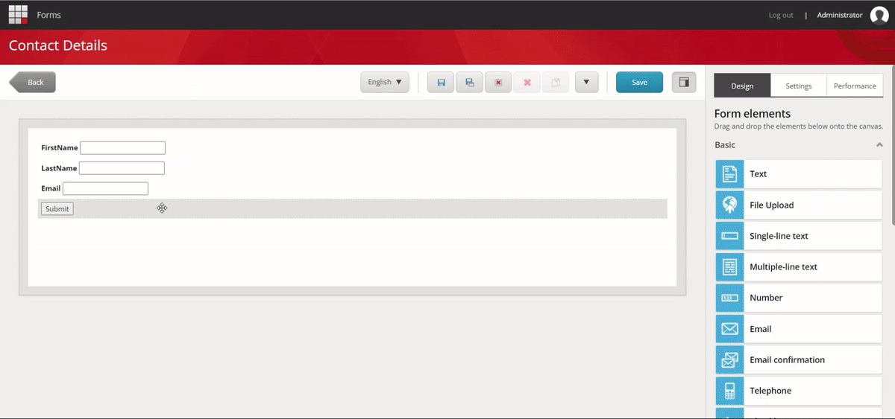
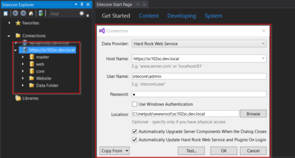
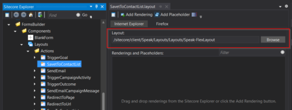
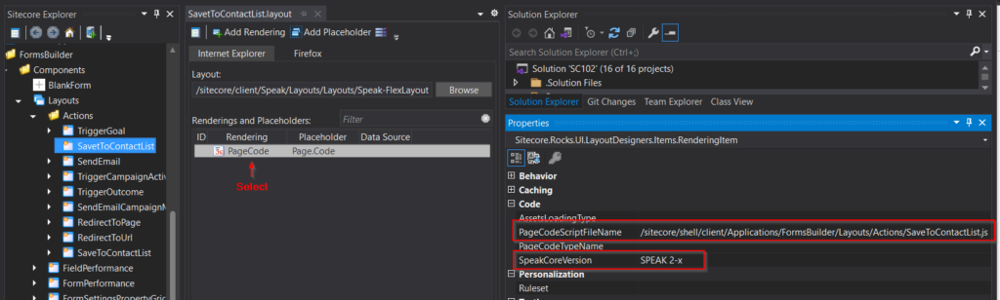
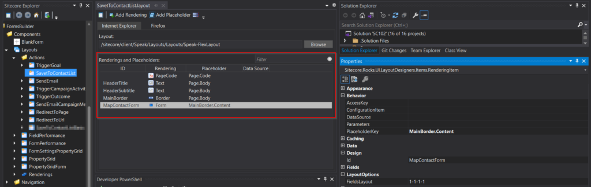
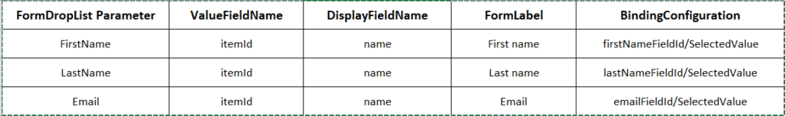
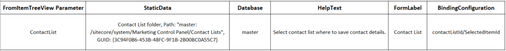
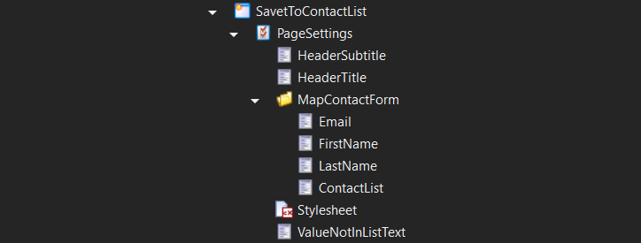
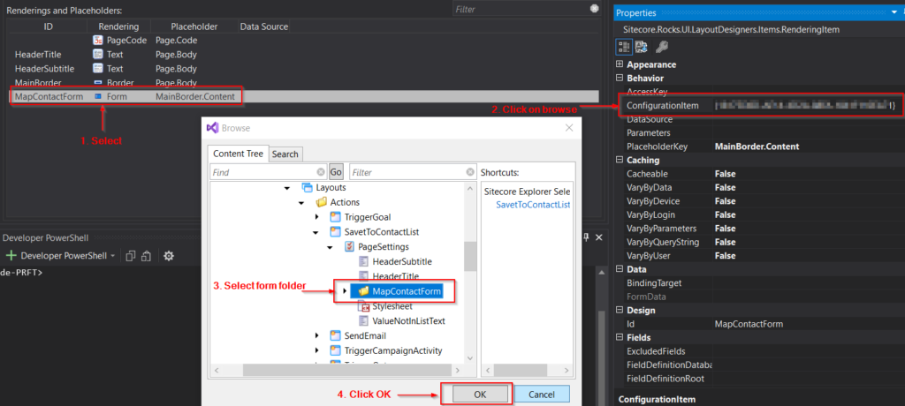
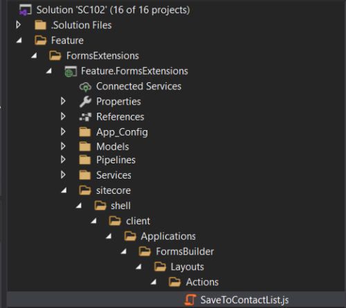

This article is the second post in the series on creating a submit action to save contacts into the list manager in Sitecore. In the [previous post](https://blogs.perficient.com/2023/05/13/submit-action-to-save-contacts-in-list-manager-basic-implementation/), we saw a basic implementation without the ability to map form fields with the custom-created submit action. It only offered the option of configuring the Contact List via the Item Tree View field.

Here are the parts of the series related to the Submit Action to Save Contacts in List Manager:

    - [Submit Action to Save Contacts in List Manager – Basic Implementation](https://blogs.perficient.com/2023/05/13/submit-action-to-save-contacts-in-list-manager-basic-implementation/)

    - [Submit Action to Save Contacts in List Manager with Fields Mapping Part 1: Create SPEAK Editor](#create-speak-editor)

    - [Submit Action to Save Contacts in List Manager with Fields Mapping Part 2: Create Submit Action](https://blogs.perficient.com/2023/06/02/submit-action-to-save-contacts-in-list-manager-with-fields-mapping-part-2/)

In this article, we will create a submit action that should have the ability to map Form fields to Contact fields. That allows us to assign the first name, last name, and email to any of the form's fields. Additionally, provide users with a tree view list to select the Contact List where they want to store the contact information.

## Submit Action to Save Contacts in List Manager with Fields Mapping

We will start by creating the editor layout (SPEAK) for the submit action from scratch. The next part will cover the steps to creating the submit action item and its code.

[caption id="attachment_335098" align="aligncenter" width="1200"]



 Form Submit Action - Save To Contact List - With Field Mapping[/caption]

The Sitecore official documentation includes a walkthrough for constructing a ⁠[submit action with field mapping](https://doc.sitecore.com/xp/en/developers/102/sitecore-experience-manager/walkthrough--creating-a-custom-submit-action-that-updates-contact-details.html). In this implementation, we will introduce an additional option to allow users to choose the Contact List in the Submit action where the contacts will get stored.

### Create SPEAK Editor Layout for Submit Action

To create the SPEAK editor from scratch, you need the [Sitecore Rocks Visual Studio plugin](https://doc.sitecore.com/xp/en/developers/speak/90/speak/visual-studio-and-sitecore-rocks.html) installed. Open Visual Studio and connect it to your Sitecore instance.

[caption id="attachment_333956" align="alignnone" width="500"]



 Sitecore Rocks Connection[/caption]

#### 1. Item Creation and Layout Configuration

    - Go to core database: */sitecore/client/Applications/FormsBuilder/Components/Layouts/Actions.*

    - Right-click on the Actions item, and Add a New Item.

    - Search for the *Speak-BasePage *template (*/sitecore/client/Speak/Templates/Pages/Speak-BasePage*). Give the item name as *SaveToContactList *in the “Enter the name of the new item” textbox at the bottom and click OK.

    - Right-click the newly formed *SaveToContactList *item and select *Tasks*, then *Design Layout*.

    - Click browse on the Layout field, and search for ***Speak-FlexLayout**** (/sitecore/client/Speak/Layouts/Layouts).* Click OK after selecting it.

[caption id="attachment_333951" align="alignnone" width="500"]



 Item Creation And Layout Configuration[/caption]

#### 2. Adding Renderings

    - Click on the *Add Rendering *button in the top-left corner.

    - In the *Select Renderings* window, search for ***PageCode**** (*If you do not see the result, make sure you have selected 'All' in the left pane*).*

    - Select PageCode under */sitecore/client/Speak/Layout/Renderings/Common* and click OK.

    - Select the PageCode rendering. Go to the properties window and update the following values.

    *PageCodeScriptFileName*: /*sitecore/shell/client/Applications/FormsBuilder/Layouts/Actions/SaveToContactList.js (*This will be the JavaScript path that contains the page code script, we will add this JS file in later steps)

    - *SpeakCoreVersion: *SPEAK 2-x

[caption id="attachment_333952" align="alignnone" width="1024"]



 Page Code - Properties Window[/caption]
    - Add renderings for *HeaderTitle, HeaderSubtitle, and ValueNotInListText.* Search for ***Text*** and then select the "*/sitecore/client/Business Component Library/version 2/Layouts/Renderings/Common/Text"* view rendering.

    - For *HeaderTitle, *select the added Text rendering and go to the properties window and set the following fields:

    Id - *HeaderTitle*

    - IsVisible - False

    - PlaceholderKey - Page.Body

    - Repeat the same step for *HeaderSubtitle, *and *ValueNotInListText*. Only the *Id* property will change as per the name. *IsVisible* and *PlaceholderKey* will be the same as above.

    - Add ***Border*** view rendering (/sitecore/client/Business Component Library/version 2/Layouts/Renderings/Containers/Border) and set its *Id* property as *MainBorder***.**

    - Add ***Form*** view rendering (/sitecore/client/Business Component Library/version 2/Layouts/Renderings/Forms/Form) and set its *Id* property as *MapContactForm*, select *FieldsLayout *property as *1-1-1-1 *and set the *PlaceholderKey* property to *MainBorder.Content.*

[caption id="attachment_333954" align="alignnone" width="1024"]



 Rendering And Placeholders[/caption]

#### 3. Adding Page and Form Parameters

    - Select the *SaveToContactList *item (*/sitecore/client/Applications/FormsBuilder/Components/Layouts/Actions/SaveToContactList)*. Right-click > Add > New Item**.**

    - Search for the *PageSettings *template (/*sitecore/client/Speak/Templates/Pages/PageSettings*). Select and enter the name *PageSettings *and then click OK.

    - Right-click on the newly created *PageSettings* item.

    - Add new items with name HeaderTitle, HeaderSubtitle and ValueNotInListText using the *Text Parameters *template (*/sitecore/client/Business Component Library/version 2/Layouts/Renderings/Common/Text/Text Parameters)*

    HeaderTitle – double-click on the item and update the **Text** field as the title of the editor popup. For example, *Map form fields*

    - HeaderSubtitle – double-click on the item and update the Text field as the subtitle title of the editor popup.

    - ValueNotInListText – double-click on the item and update the **Text** field. For example, the value is not in the select list.

    - Select the *PageSettings* item again. Right-click > New Folder and add a folder with the name *MapContactForm.*

    - Select the *MapContactForm* folder. Add three new items with the ***FormDropList Parameters*** templates with the following field values *(/sitecore/client/Business Component Library/version 2/Layouts/Renderings/Forms/Form/Templates/FormDropList Parameters)*.

[caption id="attachment_333841" align="alignnone" width="1024"]



 FormDropList Parameters[/caption]

    - Click on the *MapContactForm *folder and add an item name *ContactList* with ***FormItemTreeView Parameters*** templates *(/sitecore/client/Business Component Library/version 2/Layouts/Renderings/Forms/Form/Templates/FormItemTreeView Parameters)*. Update the field values as below:

    *StaticData* - {3C94F086-453B-48FC-9F1B-2B00BC0A55C7}

    - *Database* - master

    - *HelpText* - 'Select the contact list to save contact details'.

    - *FormLabel* - "Contact List"

    - *BindingConfiguration* - contactListId/SelectedItemId

[caption id="attachment_333840" align="alignnone" width="1024"]



 ContactList - Parameter[/caption]

```
Note: For the StaticData field in the ContactList parameter item, update the GUID of the Contact List folder.
```

    - Move the ContactList item below the LastName item (drag the ContactList item down or update the sort order value).

    - Select the *PageSettings* item.

    - Add a new item named *Stylesheet *using the template *Page-Stylesheet-File (/sitecore/client/Speak/Templates/Pages/Page-Stylesheet-File)*

    - Double-click on the new stylesheet item. Assign the value "/sitecore/shell/client/Applications/FormsBuilder/Layouts/Actions/Actions.css" to the Stylesheet field.

[caption id="attachment_334615" align="alignnone" width="724"]



 Page Settings and Form Parameters[/caption]

#### 4. Updating the Form Parameter Folder ID in the Layout

    - Select the *SaveToContactList *item and right-click > Task > Design layout.

    - Select the added *Form* rendering.

    - In the properties window, set the *ConfigurationItem* property to the ID of the *MapContactForm* folder.

[caption id="attachment_333957" align="alignnone" width="1024"]



 Update Form Parameter Folder Id In Layout[/caption]

#### 5. Adding the SaveToContactList.js File

The client script for the editor with field mapping is available [here](https://doc.sitecore.com/xp/en/developers/102/sitecore-experience-manager/walkthrough--creating-a-custom-submit-action-that-updates-contact-details.html#create-the-client-script-for-the-editor_body). We can't use this directly, as it is focused only on the FormDropList field in the MapContactForm. But we also have a FormItemTreeView (for *the contact list*). If we continue with the same script, it will cause a problem with the *setDynamicData* method.

To fix the issue, we can add an if check in the *setDynamicData* function, as shown below*:*

```
setDynamicData: function (propKey) {
                    if (this.MapContactForm.bindingConfigObject[propKey].split(".")[1] === "SelectedValue") { //To allow only FormDropList field
                        //logic to set Dynamic Data for FormDropList field
                    }
                }
```

Here is the [final client script](https://github.com/ravindra-mishra/Forms-SaveContactsToListManager/blob/master/Feature.FormsExtensions/sitecore/shell/client/Applications/FormsBuilder/Layouts/Actions/SaveToContactList.js) for the editor after making this modification. Add this [SaveToContactList.js](https://github.com/ravindra-mishra/Forms-SaveContactsToListManager/blob/master/Feature.FormsExtensions/sitecore/shell/client/Applications/FormsBuilder/Layouts/Actions/SaveToContactList.js) file in your feature project as location */sitecore/shell/client/Applications/FormsBuilder/Layouts/Actions/SaveToContactList.js*

[caption id="attachment_333955" align="alignnone" width="500"]



 SaveToContactList Javascript In Project[/caption]

Our SPEAK editor layout for the SaveToContactList custom Submit Action is now ready. The Sitecore package for the above editor item we created is available at [Core-SaveToContactList-SPEAK-Editor](https://github.com/ravindra-mishra/Forms-SaveContactsToListManager/blob/feature/field-mapping-ability/SitecorePackages/Core-SaveToContactList-SPEAK-Editor.zip). To access the entire solution, please visit the [GitHub repository](https://github.com/ravindra-mishra/Forms-SaveContactsToListManager).

In the [next post](https://blogs.perficient.com/2023/06/02/submit-action-to-save-contacts-in-list-manager-with-fields-mapping-part-2/) of this tutorial, we will go through the ***final steps for creating a submit action item and associated code***.
