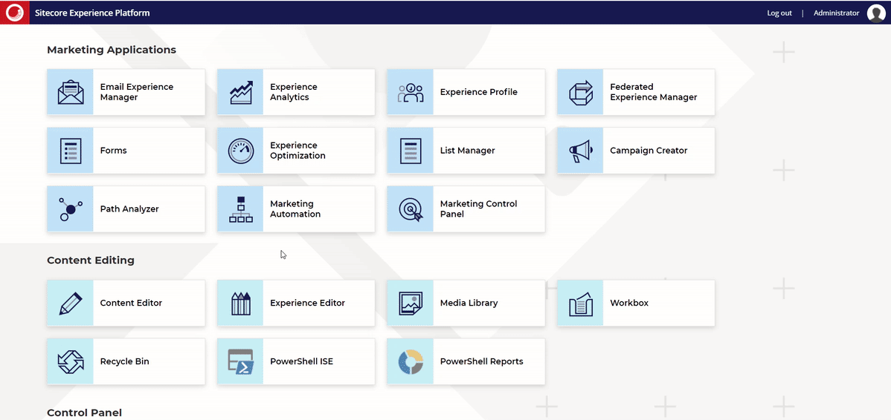
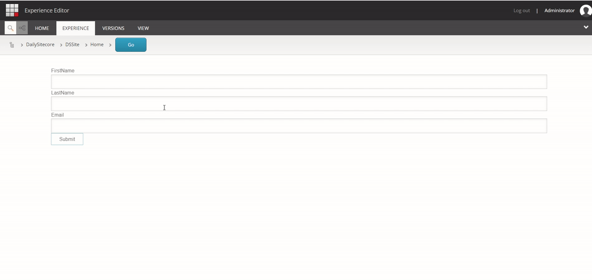

This article is the third post on creating a **Submit Action to save Contacts into the List Manager in Sitecore**. In the [previous post](https://blogs.perficient.com/2023/06/01/submit-action-to-save-contacts-in-list-manager-with-fields-mapping-part-1/), we developed the SPEAK editor layout for the custom Submit Action in the Core database for Submit Action to have **Field mapping ability**. In this part, we will construct a class to save contact list details in List Manager (Sitecore). We will also create a Submit action item in the master database and associate it with the SPEAK editor item we created in the previous article.

The series includes the following parts:

- [Submit Action to Save Contacts in List Manager – Basic Implementation](https://blogs.perficient.com/2023/05/13/submit-action-to-save-contacts-in-list-manager-basic-implementation/)

- [Submit Action to Save Contacts in List Manager with Fields Mapping Part 1: Create SPEAK Editor](https://blogs.perficient.com/2023/06/01/submit-action-to-save-contacts-in-list-manager-with-fields-mapping-part-1/)

- [Submit Action to Save Contacts in List Manager with Fields Mapping Part 2: Create Submit Action](#submitActionClassAndItem)

## Create Submit Action Class and Submit Action Item

### Step 1: Create Submit Action Class to Save Contacts in the Contact List:

Create a new model [ContactListParameter.cs](https://github.com/ravindra-mishra/Forms-SaveContactsToListManager/blob/master/Feature.FormsExtensions/Models/ContactListParameters.cs) for the parameter data as given below.

```
using System;

namespace Feature.FormsExtensions.Models
{
    public class ContactListParameters
    {
        public Guid FirstNameFieldId { get; set; }
        public Guid LastNameFieldId { get; set; }
        public Guid EmailFieldId { get; set; }
        public Guid ContactListId { get; set; }
    }
}
```

Now we will create a new class and override Execute method. Add a new class file named [SaveToContactList.cs](https://github.com/ravindra-mishra/Forms-SaveContactsToListManager/blob/master/Feature.FormsExtensions/SubmitActions/SaveToContactList.cs) in the SubmitActions folder. The [GitHub repository](https://github.com/ravindra-mishra/Forms-SaveContactsToListManager) contains the entire solution.

 

```
using System;
using System.Collections.Generic;
using System.Linq;
using Sitecore.Diagnostics;
using Sitecore.ExperienceForms.Models;
using Sitecore.ExperienceForms.Processing;
using Sitecore.ExperienceForms.Processing.Actions;
using Sitecore.XConnect;
using Sitecore.XConnect.Client;
using Sitecore.XConnect.Client.Configuration;
using Sitecore.XConnect.Collection.Model;
using Feature.FormsExtensions.Models;

namespace Feature.FormsExtensions.SubmitActions
{
    public class SaveToContactList : SubmitActionBase
    {
        public SaveToContactList(ISubmitActionData submitActionData) : base(submitActionData)
        {
        }

        protected override bool Execute(ContactListParameters data, FormSubmitContext formSubmitContext)
        {
            Assert.ArgumentNotNull(data, nameof(data));
            Assert.ArgumentNotNull(formSubmitContext, nameof(formSubmitContext));

            var firstNameField = GetFieldById(data.FirstNameFieldId, formSubmitContext.Fields);
            var lastNameField = GetFieldById(data.LastNameFieldId, formSubmitContext.Fields);
            var emailField = GetFieldById(data.EmailFieldId, formSubmitContext.Fields);

            if (firstNameField == null && lastNameField == null && emailField == null)
            {
                return false;
            }

            try
            {
                using (var client = CreateClient())
                {
                    return SaveContactInListManager(client, firstNameField, lastNameField, emailField, data.ContactListId);
                }
            }
            catch (XdbExecutionException exception)
            {
                Logger.LogError(exception.Message, exception);
                return false;
            }
        }

        private bool SaveContactInListManager(IXdbContext client, IViewModel firstNameField, IViewModel lastNameField, IViewModel emailField, Guid contactListId)
        {
            try
            {
                var reference = new IdentifiedContactReference("ListManager", GetValue(emailField));

                var expandOptions = new ContactExpandOptions(
                        CollectionModel.FacetKeys.PersonalInformation,
                        CollectionModel.FacetKeys.EmailAddressList,
                        CollectionModel.FacetKeys.ListSubscriptions);

                var executionOptions = new ContactExecutionOptions(expandOptions);

                Contact contact = client.Get(reference, executionOptions);

                if (contact == null)
                {
                    contact = new Sitecore.XConnect.Contact();
                    client.AddContact(contact);
                }

                SetPersonalInformation(GetValue(firstNameField), GetValue(lastNameField), contact, client);
                SetEmail(GetValue(emailField), contact, client);
                SetSubscriptionList(client, contact, contactListId);

                var contactIdentifier = new ContactIdentifier("ListManager", GetValue(emailField), ContactIdentifierType.Known);
                if (!contact.Identifiers.Contains(contactIdentifier))
                {
                    client.AddContactIdentifier(contact, contactIdentifier);
                }

                client.Submit();
                return true;
            }
            catch (XdbExecutionException exception)
            {
                Logger.LogError(exception.Message, exception);
                return false;
            }
        }

        private static void SetPersonalInformation(string firstName, string lastName, Contact contact, IXdbContext client)
        {
            if (string.IsNullOrEmpty(firstName) && string.IsNullOrEmpty(lastName))
            {
                return;
            }

            PersonalInformation personalInfoFacet = contact.Personal() ?? new PersonalInformation();
            if (personalInfoFacet.FirstName == firstName && personalInfoFacet.LastName == lastName)
            {
                return;
            }

            personalInfoFacet.FirstName = firstName;
            personalInfoFacet.LastName = lastName;

            client.SetPersonal(contact, personalInfoFacet);
        }

        private static void SetEmail(string email, Contact contact, IXdbContext client)
        {
            if (string.IsNullOrEmpty(email))
            {
                return;
            }

            EmailAddressList emailFacet = contact.Emails();
            if (emailFacet == null)
            {
                emailFacet = new EmailAddressList(new EmailAddress(email, false), "Preferred");
            }
            else
            {
                if (emailFacet.PreferredEmail?.SmtpAddress == email)
                {
                    return;
                }

                emailFacet.  PreferredEmail = new EmailAddress(email, false);
            }

            client.SetEmails(contact, emailFacet);
        }

        private void SetSubscriptionList(IXdbContext client, Contact contact, Guid contactListId)
        {
            var subscriptions = contact.ListSubscriptions();

            var listSubscription = subscriptions?.Subscriptions.FirstOrDefault(sub => sub.ListDefinitionId == contactListId && sub.IsActive == true);

            if (listSubscription != null)
            {
                return;
            }

            if (subscriptions == null)
            {
                subscriptions = new ListSubscriptions();
            }

            var listId = contactListId;
            var isActive = true;
            var added = DateTime.UtcNow;

            ContactListSubscription subscription = new ContactListSubscription(added, isActive, listId);

            subscriptions.Subscriptions.Add(subscription);
            client.SetListSubscriptions(contact, subscriptions);
        }

        protected virtual IXdbContext CreateClient()
        {
            return SitecoreXConnectClientConfiguration.GetClient();
        }

        private static string GetValue(object field)
        {
            return field?.GetType().GetProperty("Value")?.GetValue(field, null)?.ToString() ?? string.Empty;
        }

        private static IViewModel GetFieldById(Guid id, IList fields)
        {
            return fields.FirstOrDefault(field => Guid.Parse(field.ItemId) == id);
        }
    }
}
```

Now build and deploy the solution.

### Step 2: Create Submit Action Item in Master Database:

Switch to the master database and navigate to the following location.

```
Master: /sitecore/system/Settings/Forms/Submit Actions
```

- Right-click on the *Submit Actions* item.

- Click on *Insert*, and then select *Insert from template.*

- Select the */System/Forms/Submit Action* template, and add an item with the name *Save To Contact List*.

- Update the value of the *Model Type* field with our custom model type name.

- Update the value of the *Error Message* field. Example: “Failed to save contact details”.

- Select the “Save To Contact List” option for the *Editor* field.

- Change the icon from the Appearance section.


Save To Contact List Submit Action Item

Now the Save To Contact List custom submit action is ready. You will get this above created submit action item as a Sitecore package at [Master-SaveToContactList-SubmitAction.](https://github.com/ravindra-mishra/Forms-SaveContactsToListManager/blob/master/SitecorePackages/Master-SaveToContactList-SubmitAction.zip)

### Adding the Submit Action and Testing its Functionality

- Create an empty contact list called “Customer Contact List” in Launchpad > List Manager > Create > Empty Contact List.



Create Empty Contact List

- Make a Sitecore form with the fields First Name, Last Name, and Email.

- Add a Submit button and link it to the “Save To Contact List” submit action.

- Map the form fields for first name, last name and email.

- Save the form after selecting the newly created Contact list.


Form Submit Action – Save To Contact List – With Field Mapping

- Add *Sitecore Form Wrapper* rendering to a page and set the data source to the previously created form.

- Browse the web page and fill out the form’s required information.

- Check the data that has been provided (Launchpad > List Manager > Contact List > “Customer Contact List” > Scroll below to the Contacts section)



Form Submission And Result Verification

### Conclusion

The blogs provided a comprehensive guide to implementing the submit action for saving contacts in List Manager.

In the [first blog](https://blogs.perficient.com/2023/05/13/submit-action-to-save-contacts-in-list-manager-basic-implementation/), we explored the basic implementation process, which only allows us to save contacts to a specific Contact List.

In the [second blog](https://blogs.perficient.com/2023/06/01/submit-action-to-save-contacts-in-list-manager-with-fields-mapping-part-1/), we focused on creating a SPEAK editor to support field mapping, offering insights into customizing the user interface. Finally, in this third blog, we covered the creation of a submit action item and its backend logic that supports field mapping ability.

We hope you have found these blogs helpful. Happy Learning !!
